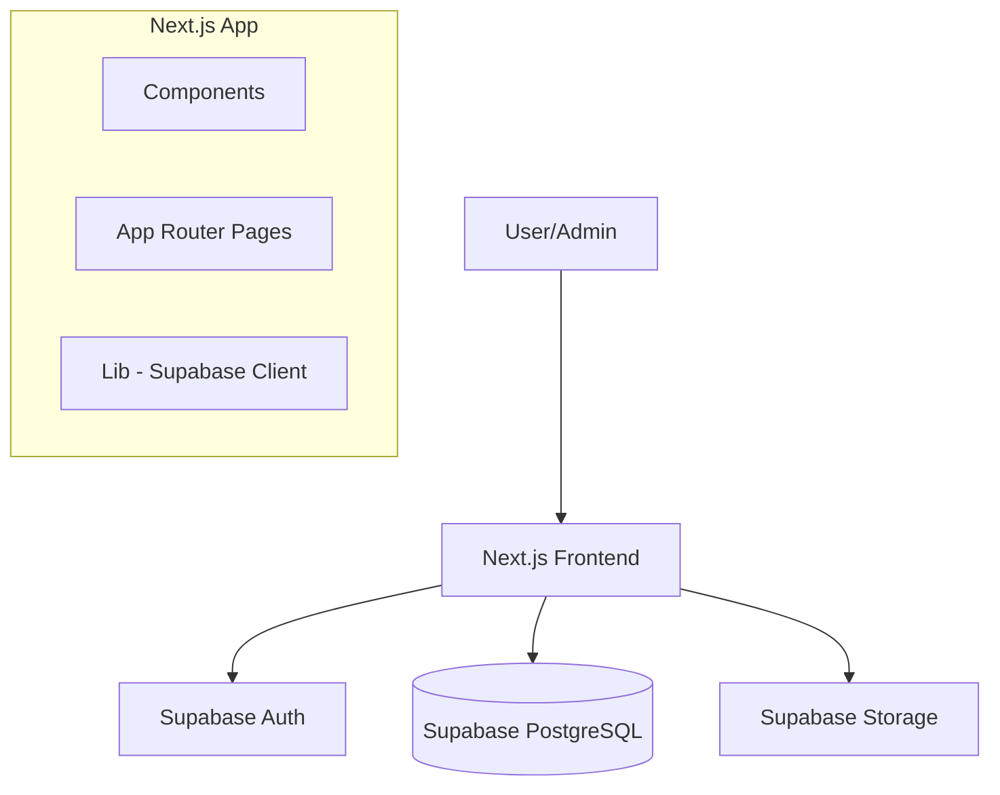

# ARCHITECTURE.md

## System Architecture
The platform follows a standard Client-Server architecture using Next.js for the frontend (Server Components + Client Components) and Supabase as the Backend-as-a-Service.

## Layer Structure
- **UI Layer (src/components):**
    - `ui/`: Shared primitive components (Button, Input, Card).
    - `layout/`: Global layout components (Navbar, Footer, Sidebar).
    - `wisdom/`: Wisdom-specific components (WisdomCard, ReflectionDetail).
    - `focus/`: Pomodoro and Focus Mode components.
- **Page Layer (src/app):** Defines routes and handles data fetching (primarily via Server Components).
- **Service Layer (src/lib):**
    - `supabase/`: Database client and helper functions.
    - `utils/`: Common utility functions.
- **Data Layer (supabase/):** Schema definitions and migrations.

## Data Flow
1. **Fetching Wisdom:** Page component calls `lib/supabase` helper -> Fetches from `wisdom` table -> Passes data to `WisdomCard`.
2. **Admin Operations:** Admin form submits data -> `supabase.from('wisdom').insert()` -> Triggers cache revalidation if necessary.
3. **Focus Mode:** Client-side state manages timer -> Local storage or DB for session tracking (if applicable).

## Module Structure
- `/src/app`: Routes and layouts.
- `/src/components`: Reusable UI components.
- `/src/lib`: API clients and shared logic.
- `/src/data`: Mock data or constants (if any).
- `/supabase`: SQL schema and migrations.
